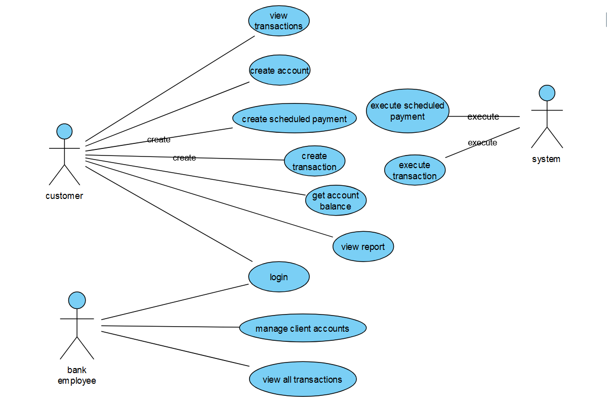

# PA165 Banking System

The Bank Management System is an application that offers a solution for managing bank accounts, transactions, and customer information. 
The system allows customers to access their accounts online, check their account balances, transfer, withdraw and deposit funds,
view transaction history and manage their account information. Users can also setup scheduled periodical payments. 
Each user account will have an associated currency. If there is an incoming transaction in a different currency, 
the system will automatically exchange the currencies. The system also provides a dashboard for bank employees to manage 
customer accounts and monitor all customers bank transactions. The system also provides a statistical module for employees, 
which can report total and average (per account) transactions (deposits, withdrawals, outgoing and incoming payments) in a selected date range.

## Use case diagram

## Artifact Structure

| Service	                    | Specification	                                                                                                        |
|-----------------------------|-----------------------------------------------------------------------------------------------------------------------|
| 	 **Infrastructure**        | 	Common implementations including exceptions, exception handling, loadbalancing, service registry, security and other |
| 	 **Account Management**    | 	  Authentification, user accounts management                                                                         |
| 	  **Account Query**        | 	 Real-time representation of current balance states of bank accounts                                                 |
| 	 **Transaction Processor** | 	 Asynchronous processor for transaction requests                                                                     |

## Module Architecture
Each service is implemented as a separate maven artifact consisting of a Spring-boot application. Within each project
we used the principles of `Hexagonal architecture`, where the domain itself consists of only pure Java classes,
with no technological dependencies. 

This architecture is ensured by creating separate packages `application` and `domain`. The application package contains technology specific
implementations for Spring and other, while the domain package contains the business logic of the given microservice.

By using such separation, we nicely created an extra separated layer on top of the
traditional `Controller, Facade, Service and Repository` layers. The main benefit of such separation is visible mainly when 
extending new features, implementation of tests and usage of custom abstractions with ease.
  
For a better visual reference of the described structure, refer to [Transaction Processor](./transaction-processor) 
where the [implementation](./transaction-processor/src/main/java/cz/muni/pa165/banking/) with the separation of domain logic creates a nicely visible hierarchy of responsibility.

## Technological dependencies
- Maven
- Java - OpenJDK21
- PostreSQL
- Docker
- OpenShift or Hashicorp Consul (still discussing which of the two to use for service registration and load-balancing)