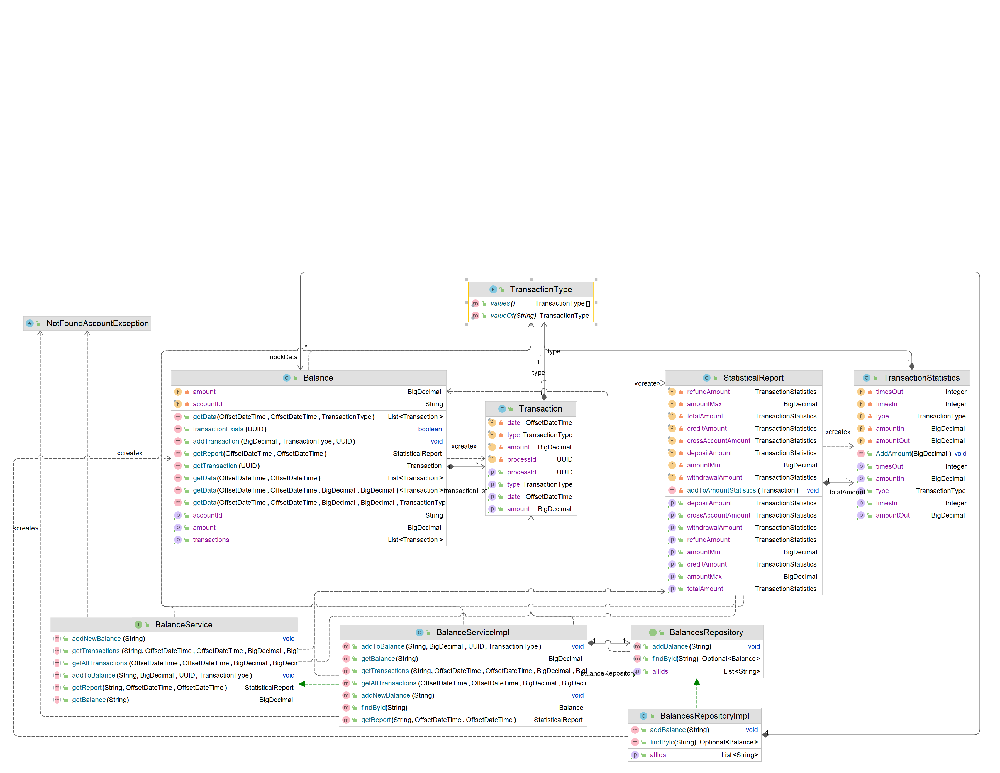

# PA165 Balance Service

The Balance Service, allows to view transaction history, provides a dashboard for bank employees to monitor all customers bank transactions. The system also provides a statistical module for employees, which can report total and average (per account) transactions (deposits, withdrawals, outgoing and incoming payments) in a selected date range.

