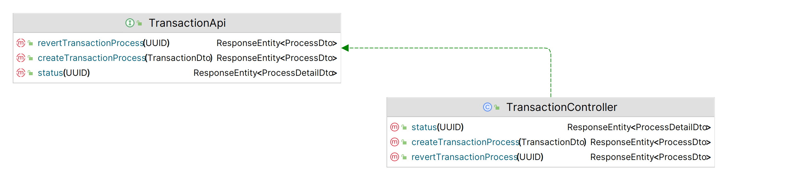
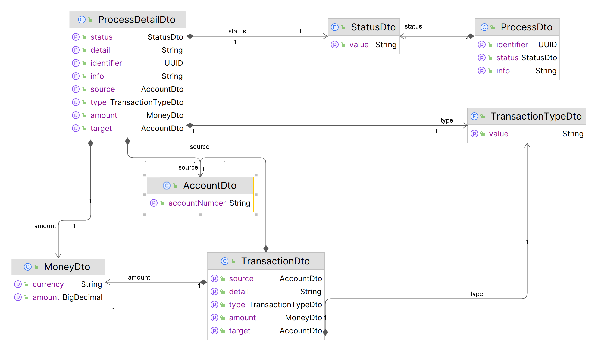
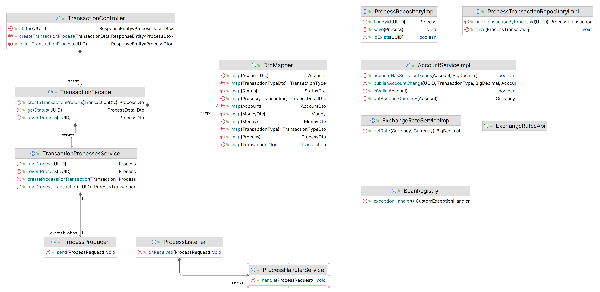
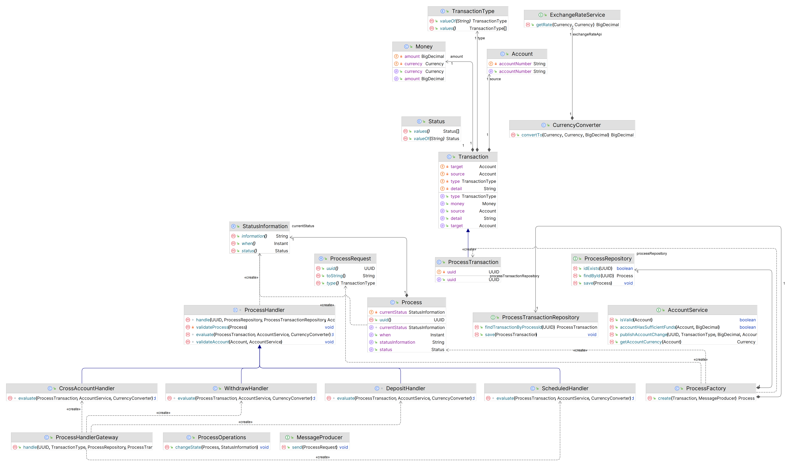

# Transaction Processor Service

Service serves as a light-weight service for serving transactions within a bank account.
It provides a series of transaction types, such as deposits, withdrawals, cross-account transactions 
and also scheduled payments.

Transactions are handles as requests, processed in an asynchronous manner where after requesting a transaction,
it provides basic information about the process created to handle the transaction. Via messaging these processes 
are handled with emphasis on fail-over. Each process consists of a series of business logic validations, when each 
of them are fulfilled the final information about balance changes in an account (or two accounts in the case of 
a cross-account/scheduled transaction) via messaging as well.

### Representation of API

### Technological layers

### Domain

